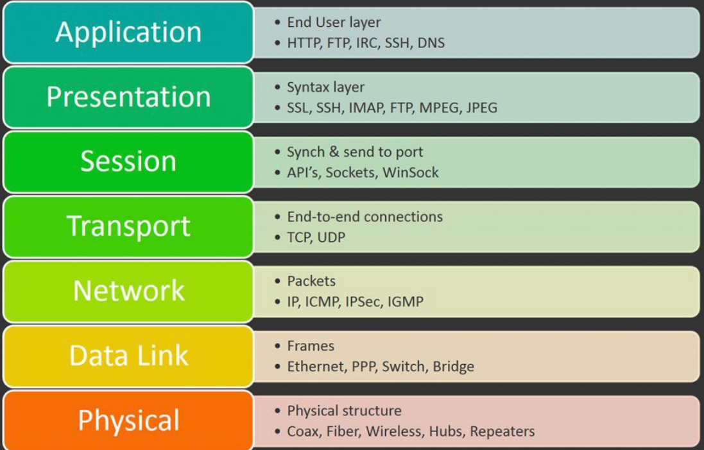

# [111-1 NTNU 網際網路概論 (Introduction to the Internet)](https://reurl.cc/AO992E)
**Teacher：[蔡芸琤教授](https://github.com/pecu)**
## Outline
>- **[Bio](#bio)**  
>- **[Notes](#notes)**
>- **[HW & Exercises](#hw--exercises)**
>- **[Projects](#projects)**
>- **[Weekly Summary](#weekly-summary)**
---  
## Bio  
>**Name:李承恩**  
>**School:國立臺灣師範大學(NTNU)**  
>**Class:科技系二年級**  

  
## Notes  
  - Useful Sites
    - <a href="https://markdown.tw/" target="_blank" rel="noopener">Markdown Syntax</a>
    - <a href="https://www.w3schools.com/" target="_blank" rel="noopener">W3School</a>
    - <a href="https://codepen.io/" target="_blank" rel="noopener">CodePen</a>
    - <a href="https://learnjavascript.online/" target="_blank" rel="noopener">Learn JS</a>
    - <a href="https://learnhtmlcss.online/" target="_blank" rel="noopener">Learn HTML & CSS</a>
    
## HW & Exercises    
1. [Static Website (Week 2)](https://patty111.github.io/web/Web1/)
2. [Create Github Repo & Github Pages Tutorial (Week 3 HW)](https://youtu.be/hsSgLKbkKLY)
3. [CRUD Tutorial: MySQL, NodeJS and ReactJS (Week 5 HW)](https://youtu.be/rHR-JAiif2s)

## Projects  

## Weekly Summary
### **Week 1**
- **Evolution of the Internet**  
  - Web 1.0 - Web 3.0
  - Metaverse & Blockchain
- **[Download and setting up Node.js and React on VScode](https://reurl.cc/m3Q96G)**  
- **Create github account and a repository**  

### **Week 2**
- **Static website (Github pages site)**  
- **W3School**
- **HTML and CSS intro**
- **[Bootstrap](https://www.youtube.com/watch?v=kl5tJALNSBM&t=443shttps://www.youtube.com/watch?v=ROGGhNpjid4)**

### **Week 3**
- **Communication Protocol**
  - OSI Model  
  

- **How data travels through the Internet**
  - [Windows terminal network commands](https://www.techrepublic.com/article/ten-windows-10-network-commands-everyone-one-should-know/)
- **DNS**
  - IPv4
  - [How does DNS work](https://reurl.cc/oQ3LWg)
- **Homework announcement**

### **Week 4**
- **Hackathon Competition introduction and promotion**
- **HTTP**
  - Status Code
  - HTTP Request
- **Web developer tool**
- **[Node.js web server implementation](https://bird23074035.medium.com/node-js-起手式-自架一個-web-server-9672f29a6102)**

### **Week 5**  
- **Homework review**
- **MySQL download and setup**
- **Database**
  - Connect database using node
  - CRUD : Create, Read, Update, Delete
- **React architecture**
### **Week 6**  
- **Homework announcement**
- **AWS Educate**
### **Week 7**  

### **Week 8**  

### **Week 9**  

